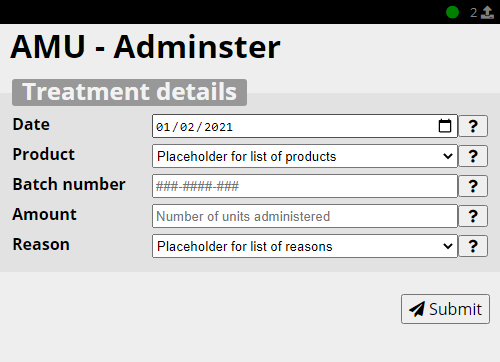
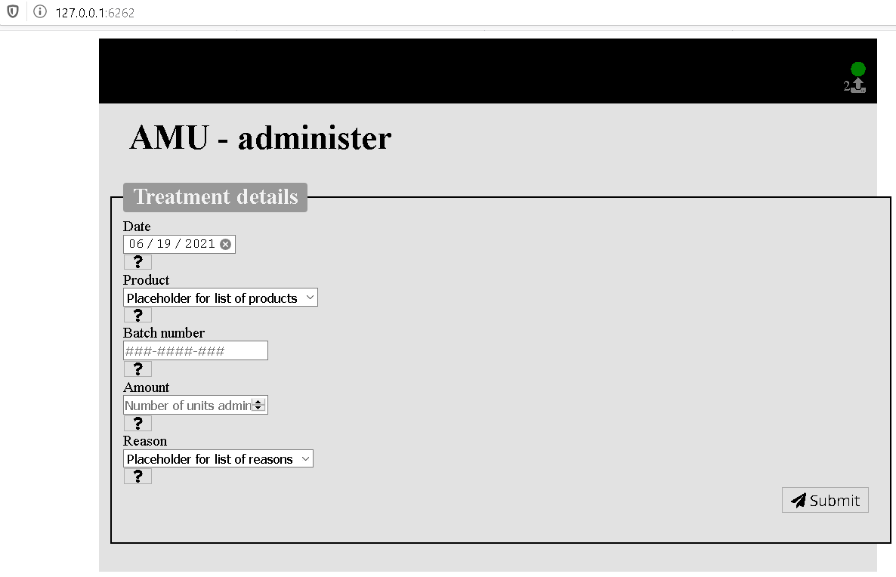

# The-CookBook

A cookbook to prepare a meal

### Author
```
PATIL Kunal
```

### Understanding the challenge: 
```
To use a cooking analogy, we are trying to prepare a meal:
The project have provided two JSON files, attached: 
•	The first, widgets.json, defines a set of HTML form elements, in terms of HTML5, CSS and JS snippets. Using the analogy, called them as ingredients. 
•	The second, form1.json is the recipe, describing how the ingredients should be combined. 
The task is to write some short code (the cook) that reads these two files, combines the ingredients (defined HTML elements) according to the recipe (form definition), to produce the finished meal
```

### Arborescence
```
|- CookBook
    |- src
        |- data (to store the recipe and ingredients files)
            |- form1.json (recipes)
            |- widgets.json (ingredients)
        |- static (to store the css and js files)
            |- css
                |- common.css
            |- js
                |- common.js
            |- images (diagrams presented in README.md)
                |- expected.png
                |- output.png
        |- templates (to store html file)
            |- home.html
        |- __init__.py (imporing data and defining application)
    |- cook.py (class to prepare the meal from recipes and ingrediants)
    |- main.py (Entry point of the project)
```

## Resources used:
```
Framework: Flask RESTful

Languages used:
    Python 
    HTML
    CSS
    Javascript
        
IDEs: 
Pycharm Professional 2020.3
```

## Usage
```
$ python main.py

> This will launch a flask application on port 6262.
```

## Output Vs Expectation




